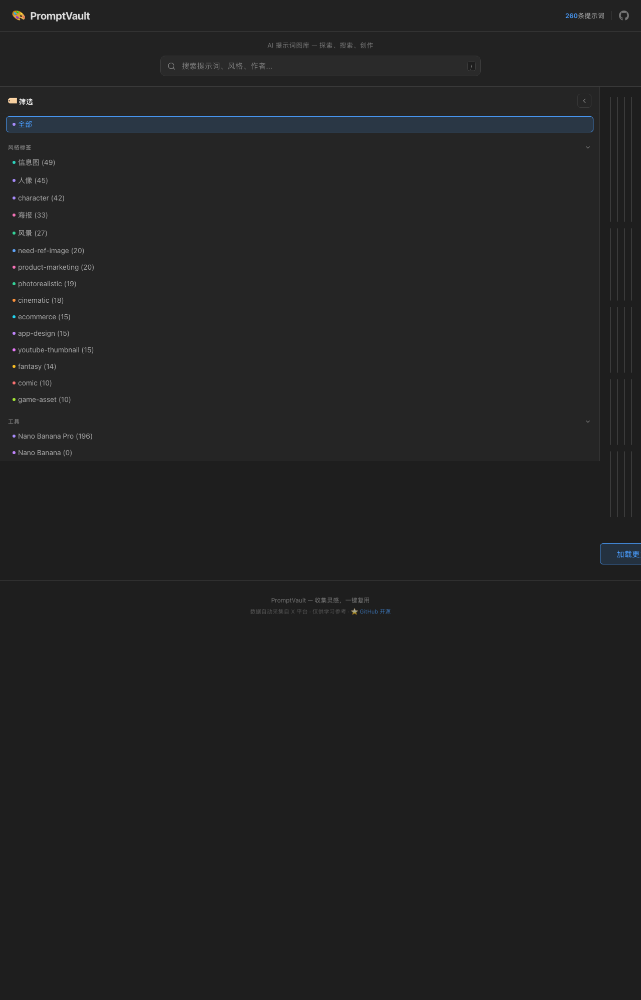

# 🎨 PromptVault — AI 生图提示词视觉图库

> 收集灵感，一键复用。一个精心策划的 AI 图片生成提示词库，配有预览图和一键复制功能。

🔗 **在线体验**: [https://coldxiangyu163.github.io/prompt-vault](https://coldxiangyu163.github.io/prompt-vault)

## Preview



## ✨ 特性

- 🖼️ **瀑布流图库** — 瀑布流布局展示 200+ 精选提示词及其生成效果图
- 🔍 **全文搜索** — 支持搜索提示词、风格标签、作者、工具（快捷键 `/`）
- 🏷️ **标签筛选** — 按风格（信息图、海报、3D、插画等）和工具（Nano Banana Pro、Gemini、Midjourney 等）过滤
- 📋 **一键复制** — 点击卡片查看完整提示词，一键复制到剪贴板
- 🔗 **溯源链接** — 每条提示词附带原始推文链接
- 📱 **响应式设计** — 适配桌面和移动端
- ♾️ **无限滚动** — 自动加载更多内容

## 📂 项目结构

```
prompt-vault/
├── index.html          # 主页面
├── style.css           # 样式（暗色主题 + 毛玻璃效果）
├── app.js              # 前端逻辑（筛选、搜索、分页、弹窗）
├── data/
│   └── prompts.json    # 提示词数据（结构化 JSON）
└── images/             # 本地预览图（200+ 张）
```

## 📊 数据格式

`data/prompts.json` 中每条记录：

```json
{
  "prompt": "完整的提示词文本...",
  "images": ["images/skill_001.jpg"],
  "tags": ["infographic", "poster"],
  "tool": "Nano Banana Pro",
  "author": "@username",
  "source_url": "https://x.com/...",
  "created_at": "2026-02-27"
}
```

## 🚀 本地运行

```bash
# 克隆仓库
git clone https://github.com/coldxiangyu163/prompt-vault.git
cd prompt-vault

# 任意静态服务器即可
python3 -m http.server 8080
# 或
npx serve .
```

打开 `http://localhost:8080` 即可浏览。

## 🤖 数据来源

提示词采集自 X (Twitter) 平台上的 AI 图片生成社区，涵盖多种工具和风格：

| 工具 | 说明 |
|------|------|
| Nano Banana Pro | Google Gemini 图片生成（专业版） |
| Nano Banana | Google Gemini 图片生成（标准版） |
| Midjourney | 老牌 AI 绘图工具 |
| Flux | Black Forest Labs 开源模型 |
| DALL-E | OpenAI 图片生成 |
| Stable Diffusion | 开源扩散模型 |

## 🤝 Contributing

我们欢迎社区贡献！你可以通过以下方式参与：

- 🎨 **提交 Prompt** — 通过 [Issue 模板](https://github.com/coldxiangyu163/prompt-vault/issues/new?template=submit-prompt.yml) 提交新的提示词
- 🐛 **报告 Bug** — 通过 [Bug Report](https://github.com/coldxiangyu163/prompt-vault/issues/new?template=bug-report.yml) 报告问题
- 💡 **功能建议** — 在 [Issues](https://github.com/coldxiangyu163/prompt-vault/issues) 中提出想法

详细的贡献指南请查看 [CONTRIBUTING.md](CONTRIBUTING.md)。

## 📝 License

MIT

---

*仅供学习参考，提示词版权归原作者所有。*
